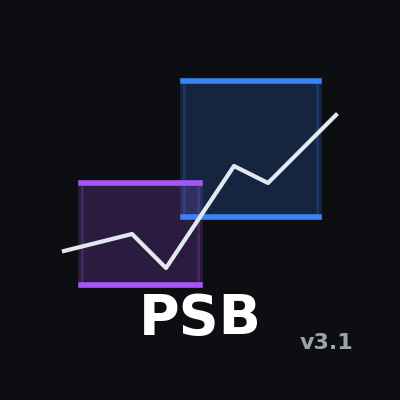
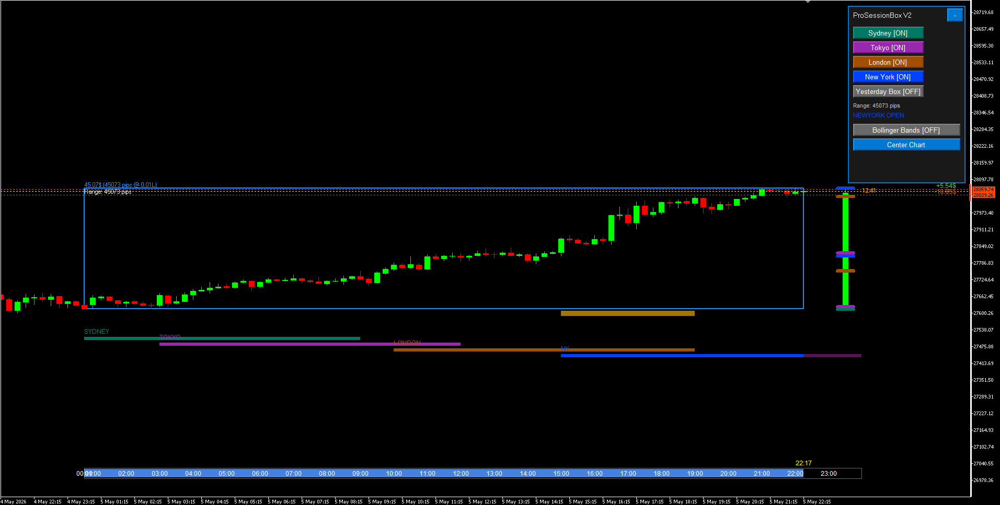

# ProSessionBox Premium

  

  <strong>Professional Daily Box + Session Tracker for MetaTrader 5</strong>

  
  
  

---

## Description

**ProSessionBox Premium** displays the **Daily price box** as a real candlestick combined with **4 major trading session bars**, a **smart time bar**, **Bollinger Bands overlay**, and **live trade position tracking** — all on one clean chart.

Designed for day traders, scalpers, and swing traders who need crystal-clear session and range visibility at a glance.

---

## Screenshot

  

---

## Features

### Daily Box
- Daily High/Low drawn as a real colored candle (Bullish / Bearish / Neutral)
- Optional Yesterday box for range comparison
- Range label: `Range: 87 pips`
- Profit label: `$0.87 (0.01L)` with configurable lot size
- **Center Chart** button in panel — manual vertical centering, no surprise rescaling

### 4 Major Trading Sessions
| Session | Color | Timezone |
|---------|-------|----------|
| Sydney | Dark Teal | UTC+10/+11 |
| Tokyo | Purple | UTC+9 |
| London | Dark Amber | UTC+0/+1 |
| New York | Blue | UTC-5/-4 |

- Full **DST** support for all sessions
- Colored horizontal bars **below** the box — no chart clutter
- Session **H/L level lines** flanking the daily candle
- Toggle each session ON/OFF from the panel

### Bollinger Bands Overlay *(v3.10)*
- Native MT5 Bollinger Bands rendered directly on the chart
- Toggle ON/OFF from the control panel with one click
- Configurable: period, deviation, upper/middle/lower colors

### Live Trade Tracker *(v3.10)*
- Dotted entry line per open position (green = buy, red = sell)
- Live P&L label **pinned to the right edge** of the chart — always visible
- **One-click close button** (×) per position — close trades without switching panels
- Requires "Allow trading" enabled on the indicator

### London/NY Overlap Highlight
- Automatic highlight during the 13:00–17:00 UTC overlap
- The highest volatility window made instantly visible

### Smart Time Bar
- Pixel-fixed progress bar — readable at any zoom
- Click any session bar to reveal it for 30 seconds

### Control Panel
- Toggle sessions ON/OFF
- Toggle Yesterday box
- Toggle Bollinger Bands
- Center Chart button
- Shows active session and daily range
- All buttons with real click-release visual feedback
- State saved across period changes (GlobalVariables)

### Alerts
- Optional popup + sound on every session open

### Performance
- `EventSetTimer(1)` — clock and P&L updated every second, not per tick
- Bar scan throttled: runs only on new bar or price break
- Objects created once, coordinates updated only
- CPU usage < 1%

---

## Parameters

### Daily Box
| Parameter | Default | Description |
|-----------|---------|-------------|
| `ShowOnlyBoxFrame` | true | Box border only (no fill) |
| `ShowYesterdayBox` | false | Show yesterday's box |
| `BoxFrameColor` | DodgerBlue | Box border color |
| `BoxFrameWidth` | 2 | Border width |
| `BoxCandleShift` | 5 | Candle position (bars from bar 0) |
| `ShowBoxLabels` | true | Show range / profit labels |
| `DisplayLotSize` | 0.01 | Lot for profit calculation |

### Sessions
| Parameter | Default | Description |
|-----------|---------|-------------|
| `ShowSydney` | true | Enable Sydney |
| `ShowTokyo` | true | Enable Tokyo |
| `ShowLondon` | true | Enable London |
| `ShowNewYork` | true | Enable New York |
| `ShowOverlapHighlight` | true | London/NY overlap highlight |
| `SessionLineHeight` | 6 | Session bar height (px) |
| `ShowLevelLines` | true | Session H/L tick marks |

### Bollinger Bands
| Parameter | Default | Description |
|-----------|---------|-------------|
| `ShowBollingerBands` | false | Enable on load |
| `BBPeriod` | 20 | BB period |
| `BBDeviation` | 2.0 | Standard deviation |
| `BBUpperColor` | RoyalBlue | Upper band color |
| `BBMiddleColor` | DimGray | Middle band color |
| `BBLowerColor` | RoyalBlue | Lower band color |

### Trade Lines
| Parameter | Default | Description |
|-----------|---------|-------------|
| `ShowTradeLines` | true | Show entry lines and P&L |

### Alerts
| Parameter | Default | Description |
|-----------|---------|-------------|
| `AlertOnSessionOpen` | false | Popup on session open |
| `SoundOnSessionOpen` | false | Sound on session open |

### Control Panel
| Parameter | Default | Description |
|-----------|---------|-------------|
| `ShowControlPanel` | true | Show the panel |
| `PanelXOffset` | 10 | X offset from right (px) |
| `PanelYOffset` | 10 | Y offset from top (px) |

---

## System Requirements

- MetaTrader 5 (build 3450+)
- Any broker, symbol (Forex, Indices, Metals, Crypto), timeframe
- Best on M5–H4

---

## Download / Purchase

| Channel | Access |
|---------|--------|
| **MQL5 Market** | Paid listing — updates and priority support |
| **Website** | [javadrazavi.fr](https://www.javadrazavi.fr/fr) — direct download |
| **GitHub (source)** | [jr-mql5-source](https://github.com/Sjrazaviebra/jr-mql5-source) — free MIT, compile yourself |

---

## Changelog

### v3.10 — 2026-05-05
- **Bollinger Bands**: native MT5 BB overlay, panel toggle, configurable colors
- **Trade lines**: entry HLINE + live P&L pinned to right edge + close button (×)
- **Auto-center**: manual only via "Center Chart" button — no surprise rescaling
- **Button UX**: all panel buttons visually release after click
- **Box margins**: reduced to 35% of daily range (was 150%)
- **Fixes**: datetime warnings, `ChartIndicatorsTotal`, `OrderSend` return check
- **MQL5 Market**: NON_LATIN clean, Article 2555 stress guards

### v2.00 — 2026-05-04
- Complete rewrite: create-once / update-only architecture
- Auto-center on load/period change via `CHART_SCALEFIX`
- Throttled bar scan, EventSetTimer clock, zombie candle fix
- Session H/L lines, London/NY overlap, pixel-fixed time bar
- DST support via `SessionTime.mqh`, GlobalVariables persistence

### v1.00 — 2025-11-21
- Initial release

---

## License

Commercial License — single user, unlimited accounts and charts. No redistribution or resale.
Free lifetime updates included.

© 2026 Javad RAZAVI — S.javad_rz@yahoo.com — [javadrazavi.fr](https://www.javadrazavi.fr/fr)
