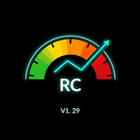
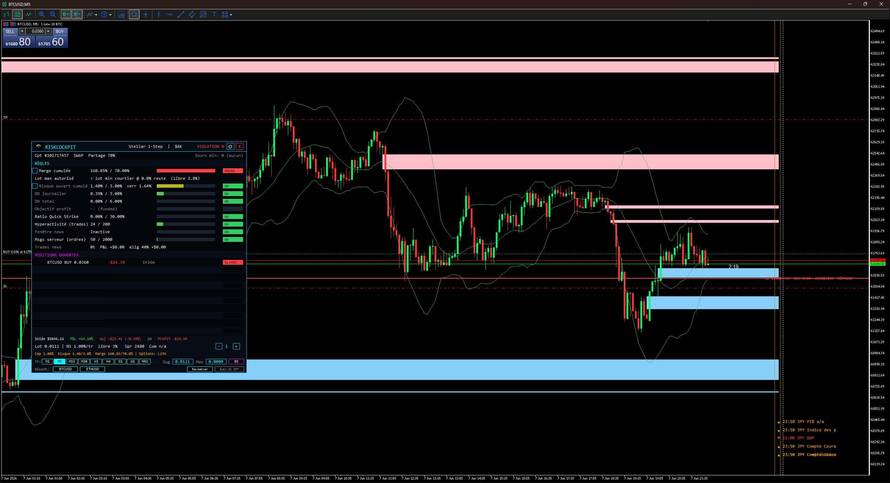

# RiskCockpit

  

  <strong>Prop-Firm Risk Manager, Drawdown Monitor &amp; Lot Sizer for MetaTrader 5</strong>

  
  
  

> Works with **FundedNext · FTMO · E8 · The5ers · MyFundedFX** + personal accounts. A real-time risk **advisor** (indicator) — it shows and proposes, it never auto-trades.

---

## Description

**RiskCockpit** is a real-time on-chart cockpit that watches every rule of your prop-firm challenge and warns you **before** you risk a breach — daily drawdown, max drawdown, margin, open risk, profit target — and proposes a lot size sized to your configured adverse price-move and clamped by your real free margin.

It is an **advisor (indicator)**: it shows and recommends; it never opens, modifies, or closes a trade.

---

## Screenshot

  

---

## What makes it different

- **Real per-trade margin via OrderCalcMargin** — the max-lot meter is broker-exact and calc-mode-aware; indices (US30, NDX100, JP225) use the real CFD-index formula with currency conversion, not a naive leverage estimate.
- **A lot PROPOSITION engine**, not just a calculator — budget per trade = min(risk-cap / N, max-risk-per-trade); the lot is sized so a stop at your configured adverse move equals that budget, then clamped by your real free margin and already-open trades.
- **Locked-risk %** — risk frozen at each position's initial stop-loss, shown distinct from current market risk.
- **Basket Breakeven advisor** — one draggable line where the combined P&L of all open positions nets to zero (commission/swap-adjusted), plus a cross-symbol portfolio P&L readout.
- **Discipline lock (advisory)** — daily-loss lockout, tilt detector, cooldown, voluntary self-lock.
- **Post-violation toggle** — one click switches margin/risk caps to a firm's stricter post-breach values, and persists.
- **Advisor by design** — because it never sends orders, a misfire cannot place or close a trade.

## Accuracy you can trust — real margin &amp; lot math

A wrong lot or margin figure is how accounts breach, so the numbers get real work:
- **Per-symbol margin from the broker engine** (OrderCalcMargin), with the correct calculation mode per instrument — indices/CFDs handled as CFD-index margin, not a generic leverage guess that can be several times off.
- **Lot sizing to the symbol's real precision** — Max lot and suggested lot are floored to the true volume step (down to 0.00001 on crypto), clamped to min/max and to your live free margin.
- The max-lot meter shows which cap is binding (per-trade %, remaining cumulative room, or free margin) — your real ceiling, right now.

---

## Compatible with

Rule-sets modeled on each firm's published rules: **FundedNext** (Stellar 1-Step / 2-Step / Lite / Instant + Futures), **FTMO**, **E8**, **The5ers**, **MyFundedFX** — plus a **Personal / broker** account mode (personal or demo accounts, with the risk tools optional). Always verify the exact figures against your own firm's current rules.

---

## What it does NOT do

RiskCockpit never auto-trades. A missing stop-loss is a warning, not an auto-placement; excess margin is a warning, not an auto-close. Automatic order placement, auto-SL, auto-close and an enforced discipline lockout are planned for the companion **RiskCockpit EA (V2)**, not released yet.

---

## Languages &amp; themes

Full **EN / FR / ES** interface, dark &amp; light themes, and an in-panel settings popup (broker, account type, risk, display, alerts) — no need to reopen the Inputs dialog.

---

## Download / Purchase

| Channel | Access |
|---------|--------|
| **MQL5 Market** | Paid listing — updates and priority support |
| **Website** | [javadrazavi.fr](https://www.javadrazavi.fr/fr) |

Buy once **$99**, or rent monthly (from **$30/month**). A **free demo** runs in the MT5 Strategy Tester.

---

## License

Commercial License — single user, unlimited accounts and charts. No redistribution or resale. Free lifetime updates included.

© 2026 Javad RAZAVI — S.javad_rz@yahoo.com — [javadrazavi.fr](https://www.javadrazavi.fr/fr)
